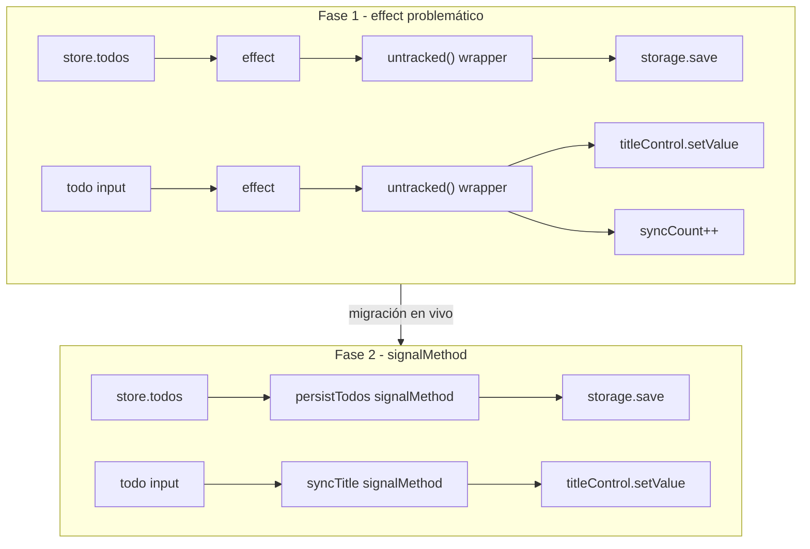

# Propuesta de Tutorial para YouTube: Domina `signalMethod` de NgRx en Angular

## 1. El Hook del Video (¿Por qué grabar esto?)

**El problema:** Cuando los desarrolladores de Angular empiezan a usar Signals, a menudo abusan de `effect()`. Esto lleva a problemas de *implicit tracking* (rastreo implícito no deseado), bucles infinitos, y la necesidad constante de ensuciar el código con funciones como `untracked()`.

**La solución:** `@ngrx/signals` introdujo `signalMethod`, una forma elegante de reaccionar a cambios en signals para ejecutar lógica imperativa de forma aislada — similar a los *Effects* clásicos de NgRx o `rxMethod`, pero sin RxJS.

**Estado del repo (todo-app-ngrx):**

| Qué | Dónde |
|-----|-------|
| Proyecto | MyDayApp — todo app con **Signal Store** |
| Dependencia | `@ngrx/signals` ya instalada |
| **Código actual** | **Fase 1** — `effect()` + `untracked()` |
| Migración en vivo | Buscar `// TODO (signalMethod` en el código |
| Tests | Karma + Jasmine — `pnpm ng test` |
| E2E | Playwright — `pnpm run e2e` |

```bash
pnpm install
pnpm start          # http://localhost:4200
pnpm ng test        # unit tests
pnpm run e2e        # 20 tests Playwright
```

---

## 2. Enfoque pedagógico: dos fases

| Fase | Qué muestra | Estado en repo |
|------|-------------|----------------|
| **Fase 1** | `effect()` + `untracked()` + problemas de testing | **Implementada** — código actual |
| **Fase 2** | `signalMethod` — solución final | Migrar en vivo siguiendo los `// TODO` |



---

## 3. SLIDES — Caso 1: Persistencia en `TodosStore`

**Archivo:** `src/app/services/todos.store.ts`  
**Idea:** signal `todos` → API imperativa (`StorageService.save`)

### Punto de partida (antes de Fase 1)

Cada método llamaba `persist()` manualmente — repetido 6 veces.

### BEFORE — Fase 1: `effect` + `untracked` (código actual en repo)

```typescript
// src/app/services/todos.store.ts
import { computed, effect, inject, untracked } from '@angular/core';
import { signalStore, withHooks, patchState, /* ... */ } from '@ngrx/signals';

withMethods((store) => ({
  add(title: string): void {
    patchState(store, { todos: [...store.todos(), newTodo] });
    // ✅ solo patchState — el effect persiste
  },
  // remove, toggle, update, clearCompleted — igual
})),
withHooks({
  onInit(store) {
    const storage = inject(StorageService);
    patchState(store, { todos: storage.readStorage() });

    effect(() => {
      const todos = store.todos(); // 👈 tracked

      // untracked: storage.save es un side effect imperativo — no debe re-trackearse.
      // Si aquí leyéramos/escribiéramos otro signal sin untracked, el effect
      // se re-ejecutaría en bucle (implicit tracking).
      untracked(() => {
        storage.save(todos);
      });
    });
  },
}),
```

**Problemas para el video:**
- Hay que envolver **toda** la lógica imperativa en `untracked()`.
- Mezcla "qué signals observo" con "qué side effects ejecuto".
- Difícil de testear de forma aislada.

### AFTER — Fase 2: `signalMethod` (migración en vivo)

```typescript
// src/app/services/todos.store.ts
import { inject } from '@angular/core';
import { signalStore, withHooks, patchState, signalMethod /* ... */ } from '@ngrx/signals';

withMethods((store) => ({
  add(title: string): void {
    patchState(store, { todos: [...store.todos(), newTodo] });
  },
  // remove, toggle, update, clearCompleted — solo patchState
})),
withHooks({
  onInit(store) {
    const storage = inject(StorageService);
    patchState(store, { todos: storage.readStorage() });

    const persistTodos = signalMethod<Todo[]>((todos) => {
      storage.save(todos);
    });
    persistTodos(store.todos); // 👈 wiring reactivo explícito
  },
}),
```

**Ganancias:**
- Sin `untracked()`.
- Sin `effect()`.
- Side effect en un solo lugar, testeable.

### Demo en vivo (Fase 1)

1. Mostrar los `// TODO (signalMethod — Caso 1)` en el archivo.
2. Migrar siguiendo los TODOs.
3. Agregar todo → recargar browser → persistencia OK.

---

## 4. SLIDES — Caso 2: FormControl sync en `TodoComponent`

**Archivo:** `src/app/components/todo/todo.component.ts`  
**Idea:** cuando cambia el `todo` input → sincronizar `titleControl` (edición inline)

### BEFORE — Fase 1: `effect` + `untracked` (código actual en repo)

```typescript
// src/app/components/todo/todo.component.ts
import { effect, signal, untracked /* ... */ } from '@angular/core';

export class TodoComponent {
  readonly todo = input.required<Todo>();
  readonly syncCount = signal(0);
  titleControl = new FormControl('', { nonNullable: true });

  constructor() {
    effect(() => {
      const title = this.todo().title; // 👈 tracked

      // untracked: setValue y syncCount.update son writes imperativos.
      // Sin untracked, syncCount quedaría trackeado → el effect se re-dispara
      // al incrementar el contador → bucle infinito (implicit tracking).
      untracked(() => {
        this.titleControl.setValue(title);
        this.syncCount.update((count) => count + 1);
      });
    });
  }
}
```

**Demo en vivo:** quitar `untracked()` → loop infinito al incrementar `syncCount`.

### AFTER — Fase 2: `signalMethod` (migración en vivo)

```typescript
// src/app/components/todo/todo.component.ts
import { signal } from '@angular/core';
import { signalMethod } from '@ngrx/signals';

export class TodoComponent {
  readonly todo = input.required<Todo>();
  readonly syncCount = signal(0);
  titleControl = new FormControl('', { nonNullable: true });

  private readonly syncTitle = signalMethod<Todo>((todo) => {
    this.titleControl.setValue(todo.title);
    this.syncCount.update((count) => count + 1); // ✅ seguro — no trackea
  });

  constructor() {
    this.syncTitle(this.todo); // 👈 wiring reactivo explícito
  }
}
```

### Qué NO migrar (anti-patrones)

```typescript
// ✅ Acciones directas del usuario — NO signalMethod
escape()              // reset manual al cancelar
enableEditingMode()   // focus tras dblclick
toggle() / remove()   // eventos DOM → store.add/toggle/remove
```

---

## 5. SLIDES — Testing: `effect` vs `signalMethod`

**Stack:** Karma + Jasmine · Angular 22 · `TestBed.tick()` (reemplaza `flushEffects` deprecado)

### BEFORE — Test con `effect` (Fase 1, indirecto)

```typescript
// src/app/components/todo/todo.component.spec.ts
describe('effect (Fase 1)', () => {
  it('should sync title when todo input changes', fakeAsync(() => {
    fixture.componentRef.setInput('todo', {
      id: '1', title: 'Updated', completed: false,
    });
    TestBed.tick(); // obligatorio — sincroniza effects + change detection

    expect(component.titleControl.value).toBe('Updated');
    expect(component.syncCount()).toBeGreaterThan(0);
  }));
});
```

```typescript
// src/app/services/todos.store.spec.ts
it('should persist when todos change (indirect)', fakeAsync(() => {
  store.add('Buy milk');
  TestBed.tick();

  expect(saveSpy).toHaveBeenCalled();
  // ❌ No puedes invocar persist() de forma aislada
}));
```

**Problemas:**
- `TestBed.tick()` obligatorio (antes era `flushEffects`, deprecado en Angular 20+).
- Verificación indirecta — mutas state y esperas el side effect.
- No puedes pasar params fijos a la lógica de sync.

### AFTER — Test con `signalMethod` (Fase 2, directo)

```typescript
// src/app/components/todo/todo.component.spec.ts
it('should sync title when syncTitle is called directly', () => {
  component['syncTitle']({ id: '1', title: 'Test title', completed: false });

  expect(component.titleControl.value).toBe('Test title');
  expect(component.syncCount()).toBe(1);
  // ✅ Sin TestBed.tick(), sin setInput, sin detectChanges
});
```

```typescript
// src/app/services/todos.store.spec.ts
it('should persist todos when add is called', fakeAsync(() => {
  store.add('Buy milk');
  TestBed.tick();

  expect(saveSpy).toHaveBeenCalled();
  // Con signalMethod la lógica persistTodos es invocable directamente en unit test puro
}));
```

### Setup de mocks (patrón usado en el repo)

```typescript
// TodoComponent spec — mock tipado (evita errores de spyOn con 'never')
storageMock = jasmine.createSpyObj('StorageService', ['readStorage', 'save']);
storageMock.readStorage.and.returnValue([] as Todo[]);

providers: [{ provide: StorageService, useValue: storageMock }]
```

### Tabla comparativa (slide resumen)

| | `effect()` | `signalMethod` |
|---|-----------|----------------|
| Invocar lógica con params fijos | ❌ Solo vía signals | ✅ `syncTitle({ ... })` |
| Aislar side effect en test | ❌ Difícil | ✅ Directo |
| Setup de test | `TestBed.tick()`, timing | Llamada + expect |
| `untracked()` necesario | ✅ Sí | ❌ No |
| Riesgo de loop infinito | Alto | Bajo |

---

## 6. SLIDES — Regla de oro

| Herramienta | Cuándo usarla |
|-------------|---------------|
| `rxMethod` | Streams RxJS, HTTP con cancelación, route params |
| `signalMethod` | Lógica imperativa reaccionando a un signal — **testeable como función** |
| `effect()` | Logging, analytics — **última opción** |
| Métodos del store / handlers DOM | Acciones directas del usuario |

> `signalMethod` **no reemplaza** `rxMethod`. Cada herramienta tiene su lugar.

### Casos descartados en este repo

| Ubicación | Veredicto | Razón |
|-----------|-----------|-------|
| `TodosComponent` — `route.paramMap.subscribe` | ❌ | Stream RxJS → `rxMethod` |
| `HeaderComponent` — add todo | ❌ | Acción directa → `store.add()` |
| `TodoService` | Ignorar | Legacy RxJS sin referencias |
| Toggle, remove, clear | ❌ | Eventos DOM → métodos del store |

---

## 7. SLIDES — Migración paso a paso (live coding)

### Caso 1 — TodosStore

Buscar en `todos.store.ts`:

```
// TODO (signalMethod — Caso 1): importar signalMethod desde '@ngrx/signals'
// TODO (signalMethod — Caso 1): crear persistTodos = signalMethod<Todo[]>((todos) => storage.save(todos))
// TODO (signalMethod — Caso 1): conectar con persistTodos(store.todos)
// TODO (signalMethod — Caso 1): eliminar effect + untracked de abajo
```

### Caso 2 — TodoComponent

Buscar en `todo.component.ts`:

```
// TODO (signalMethod — Caso 2): importar signalMethod desde '@ngrx/signals'
// TODO (signalMethod — Caso 2): crear syncTitle = signalMethod<Todo>((todo) => { ... })
// TODO (signalMethod — Caso 2): conectar con syncTitle(this.todo) en el constructor
// TODO (signalMethod — Caso 2): eliminar effect + untracked de abajo
```

### Tests post-migración

1. Actualizar `todo.component.spec.ts` — reemplazar describe Fase 1 por test de invocación directa.
2. Correr `pnpm ng test --no-watch --browsers=ChromeHeadless`.
3. Correr `pnpm run e2e` — 20 tests deben pasar.

---

## 8. Escaleta para YouTube

| Tiempo | Sección | Contenido |
|--------|---------|-----------|
| **0:00 – 1:30** | Hook | Abre app (`pnpm start`). Explica implicit tracking y por qué Angular dice "effects como última opción". |
| **1:30 – 3:00** | Teoría | `signalMethod` vs `rxMethod` vs `effect()`. El repo ya usa Signal Store. |
| **3:00 – 5:00** | Slide + demo Fase 1 | Muestra `effect` + `untracked` en store y componente. Explica comentarios en código. |
| **5:00 – 5:30** | Demo loop | Quita `untracked()` en TodoComponent → bucle infinito con `syncCount`. |
| **5:30 – 7:00** | Testing Fase 1 | Test con `TestBed.tick()`. Muestra fragilidad. |
| **7:00 – 9:30** | Live coding Fase 2 | Sigue los `// TODO`. Migra store → componente. |
| **9:30 – 10:30** | Testing Fase 2 | `syncTitle({...})` directo. `pnpm ng test`. |
| **10:30 – 11:00** | Anti-patrones | Qué NO migrar (toggle, route params, etc.). |
| **11:00 – 12:00** | Resumen + CTA | Tabla comparativa. Regla de oro. |

---

## 9. Checklist pre-grabación

- [x] `@ngrx/signals` instalado
- [x] Código Fase 1 en repo con `// TODO (signalMethod` markers
- [x] Comentarios `untracked` explicativos en store y componente
- [x] Specs Jasmine (`todo.component.spec.ts`, `todos.store.spec.ts`)
- [x] `TestBed.tick()` en lugar de `flushEffects` deprecado
- [ ] `pnpm start` → verificar app en `http://localhost:4200`
- [ ] `pnpm ng test` + `pnpm run e2e` antes de grabar
- [ ] Preparar slides con bloques BEFORE/AFTER de secciones 3, 4 y 5

---

## 10. Apéndice — Config de tests (referencia)

Si el IDE marca errores en `.spec.ts` (`expect` not found, `spyOn` → `never`):

| Fix | Archivo |
|-----|---------|
| Excluir specs del tsconfig principal | `tsconfig.json` → `"exclude": ["**/*.spec.ts"]` |
| Jasmine types + paths | `tsconfig.spec.json` → `"types": ["jasmine"]` |
| Mock tipado en lugar de `spyOn` frágil | `jasmine.createSpyObj` + `providers: [{ provide: StorageService, useValue }]` |
| Sincronizar effects en tests | `TestBed.tick()` (Angular 20+, reemplaza `flushEffects`) |
